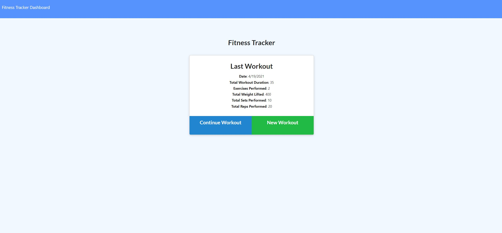
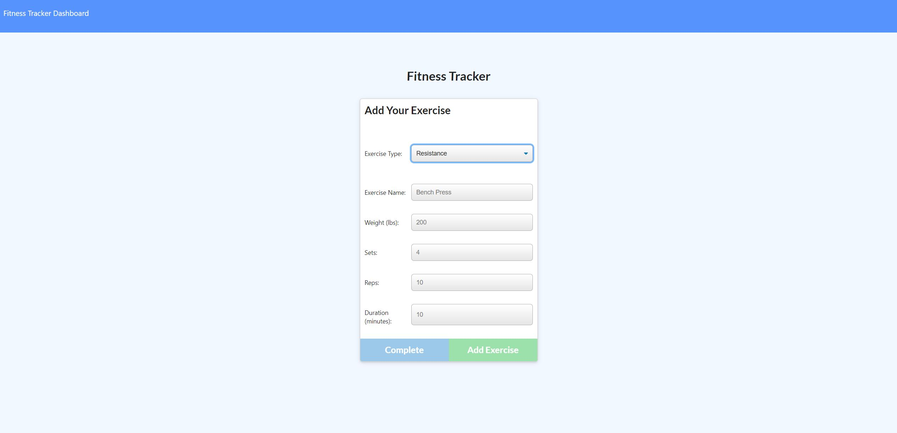

# Fitness-Tracker

## Description
    
I created the back-end of a fitness tracker website. The user can create workouts and add exercises to already created workouts. The website also tracks and provides statistics of previous workouts. 
    
## Table of Contents
1. [Installation](#installation)
2. [Usage](#usage)
3. [License](#license)
4. [Questions](#questions)
5. [Credits](#credits)
    
## Installation
    
[Deployed Application](https://guarded-tor-62033.herokuapp.com/)
    
## Usage

## License
    
MIT License
    
Copyright (c) 2021 Mike Coletta
          
## Questions?
    
[Github](https://github.com/MikeColetta)
    
For any questions, please send me an [email](mailto:coletta.mike@gmail.com).